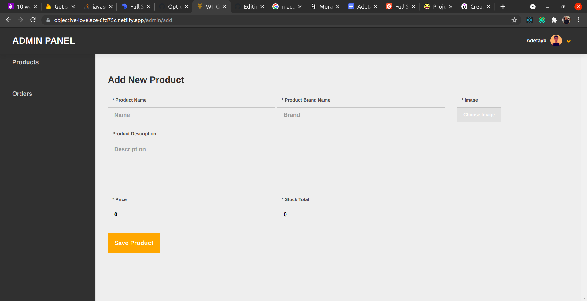
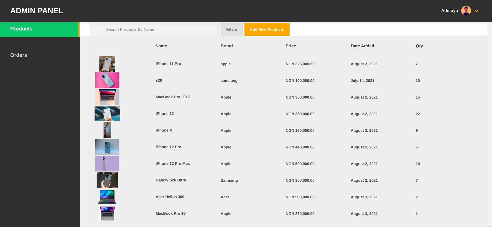
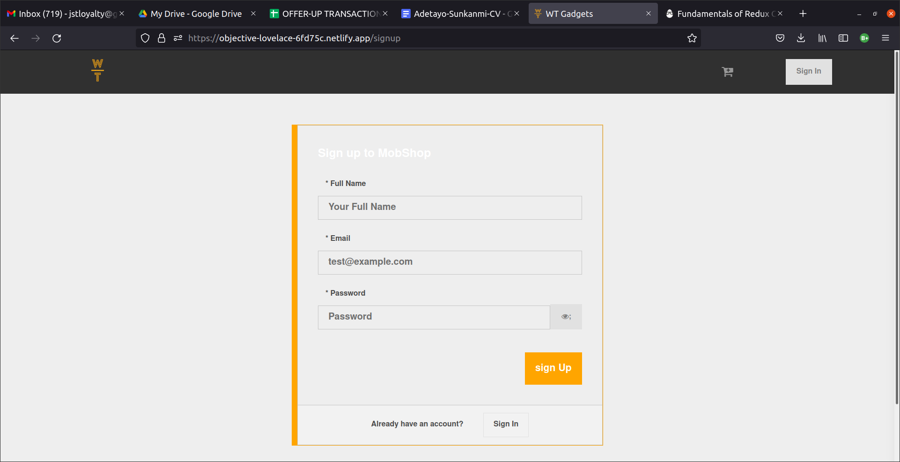
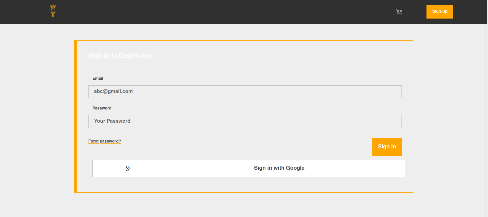
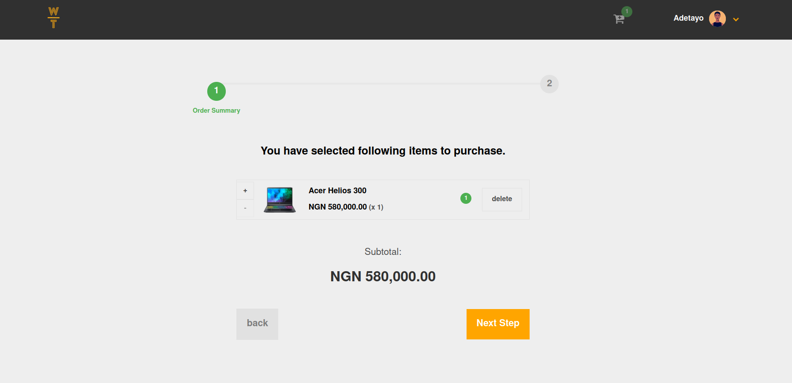
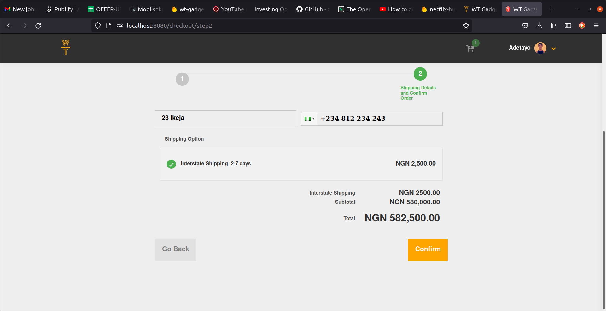
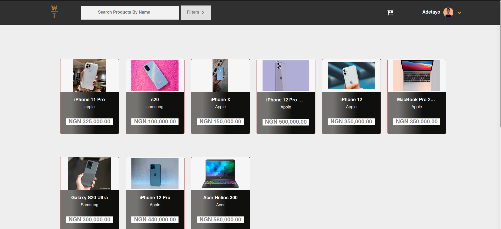
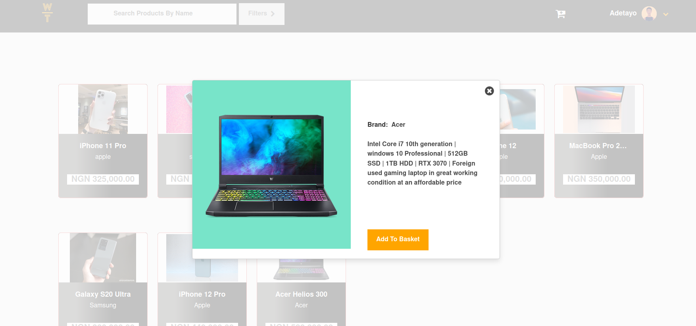

## Developer Job Board

<!--
*** Thanks for checking out this README Template. If you have a suggestion that would
*** make this better, please fork the repo and create a pull request or simply open
*** an issue with the tag "enhancement".
*** Thanks again! Now go create something AMAZING! :D
-->

<!-- PROJECT SHIELDS -->

<p align="center">
  <a href="https://github.com/ignatius22/redux-bookstore">
    
  </a>

  <p align="center">
    This project is a solo project to sharpen my React/Redux skill. 
  </p>
</p>

<!-- TABLE OF CONTENTS -->

## Table of Contents

- [About the Project](#about-the-project)
- [Contributors](#Installation)
- [Contributors](#contributors)
- [Acknowledgements](#acknowledgements)
- [License](#license)

## About The Project

This project is a React-Redux full e-commerce website; it is full desktop app. Use webpack, firebase and a bunch of other technologies to improve my React skill and have a better understanding. It has the following features:

### Admin Panel

In the admin panel you can do the following:
- See Orders
- See total products
- Add product
- Edit product
- Delete product

<p align="center">
    
</p>

<p align="center">
    
</p>

### User's Panel

In the user's panel you can do the following:
- Sign Up
- Sign In (With Google or Email and Password)

<p align="center">
    
</p>

<p align="center">
    
</p>

### Edit Account Panel

In this project, users can also Edit their account. By editing the updating their profile banner, profile avatar, name, address and phone number.

### Checkout Panel

In this panel/page, user can view Product they order, total price and also add or remove item from the cart. Also included is the shipping method and shipping mobile number.

<p align="center">
    
</p>

<p align="center">
    
</p>

<p align="center">
    
</p>
Home page


<p align="center">
    
</p>
Product view


## Live Link  (Netlify)
[Project live link](https://objective-lovelace-6fd75c.netlify.app/)

## Installation

To run 'WT-tech ecommerce' locally, clone the repository, navigate to the cloned directory.

#### Follow these commands step by step:

```
github.com:jstloyal/WT-tech.git
cd WT-tech.git
npm install
npm run dev-server
```

### Built With

This project was built using these technologies.

- React
- Redux
- VS Code editor
- NPM
- GitHub
- webpack
- Firebase
- Bootstrap
- Netlify

## Contributors

**Author**

​**Adetayo Sunkanmi**

- Github: [jstloyal](https://github.com/jstloyal)
- Twitter: [@jstloyalty](https://twitter.com/jstloyalty)
- Linkedin: [Adetayo Sunkanmi](https://www.linkedin.com/in/jstloyalty)
- E-mail: jstloyalty@gmail.com

<!-- ACKNOWLEDGEMENTS -->

## Acknowledgements

- 

## License

📝
This project is [MIT](https://opensource.org/licenses/MIT) licensed.
